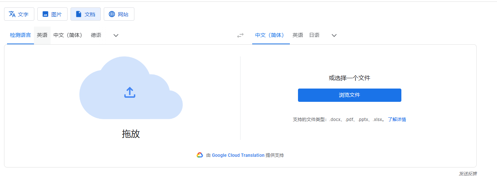
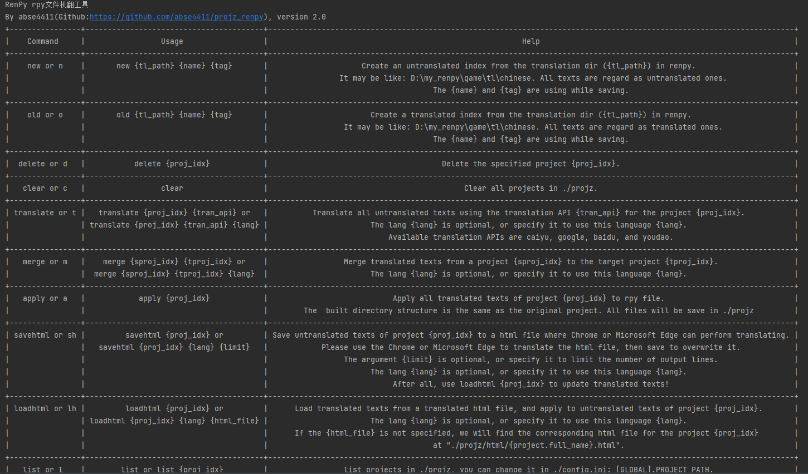

<div align="center">
  
  <br />

[](https://github.com/abse4411/projz_renpy_translation)
[](https://github.com/abse4411/projz_renpy_translation/blob/devp/LICENSE)

[📘文档（Chinese only）](#) |
[🛠安装](#运行环境准备) |
[💡建议](https://github.com/abse4411/projz_renpy_translation/issues)

简体中文 | [English (N/A)](#帮助我们翻译help-us-translate-the-documentation)

</div>

# 🍕RenPy翻译工具
- 通过本工具，您可用来：
  - 以项目为单位来管理您RenPy游戏翻译版本(在您的翻译文件夹下`/your_renpy_game/game/tl`)，支持多种语言(`/game/tl`下的子文件夹)
  - 合并/迁移您的同一游戏旧版本的翻译文本到新版本中。这可以让旧版本的翻译文本得到复用。
  - 使用不同翻译方式翻译您的RenPy游戏。目前支持三种方式：
    - 利用Selenium调用Chrome的Web翻译🌐(可用的Web API翻译引擎：Google、Caiyun、Youdao、Baidu
    - 使用Microsof Edge的网页全文翻译功能或者使用excel文件上传到支持翻译网站
    - 使用来自[dl-translate](https://github.com/xhluca/dl-translate)的AI模型翻译🤖
  - 导入和导出游戏翻译文本，这使得您可手动翻译或者修改错误的翻译。
  - 使用一些辅助性工具(目前还在开发中)，比如将已翻译文本重置为未翻译状态，针对翻译项目的excel文件导入导出
- 我们项目参考了这些项目，见: [Acknowledgement](#Acknowledgement)
- 该代码仅供学习使用，我们不提供任何游戏文件❗
- 我们将运行环境和程序打包为exe，见代码目录下的[parse_console.exe](parse_console.exe)。因此您可以直接运行程序(仅限在64位的Windows系统)，而不需要安装任何依赖库(包括Python🐍!)。但是以下翻译功能将无法使用：
  - AI模型翻译🤖
  
  如果您想使用完整功能请安装完整的环境：[运行环境准备](#运行环境准备)
***

👀已经了解以上内容，想要开始使用，请跳转到👉[这里](#运行环境准备)👈

# 🙏帮助我们翻译(Help us translate the documentation)

如果您觉得本项目有用，即使您不会进行Python开发，也可以帮助我们翻译这个界面到其他语言。😀

If you like this project, you can help us translate this page. That would be great! 😀

***

# 📜Changelog:

* V0.3.7: 
  
  * 添加了新命令`revert`，其功能与`apply`命令相反，即把翻译的文本变成原始未翻译的文本
  * 改进了`dump`命令输出，现在您可以输出项目所有翻译和未翻译的文本到excel文件，且按文件分别输出到不同的sheet中，同一个sheet文本按行号排序。
  * 添加了新命令`update`，它可以配合`dump`命令使用，因此您可以通过修改`dump`命令导出excel文件来更正一个项目中翻译或者未翻译的文本。这类似`saveexcel`和`loadexcel`命令

* V0.3.6: 修复了使用web翻译多线程的问题，部分命令功能改进

* V0.3.5: 基于开源项目[dl-translate](https://github.com/xhluca/dl-translate)，我们集成AI模型进行翻译，实现离线翻译的功能。 对应的新命令为`dltranslate`，见[使用dltranslate命令进行ai翻译](#使用dltranslate命令进行ai翻译)

* V0.3.4: 我们把程序和运行环境打包成exe，现在您不需要python环境就可以运行程序。仅支持64位的Windows 10, 11系统

* V0.3.3: 修复`apply`命令替换空文本的问题；翻译文本识别改进；新命令`accept`:针对那些不需要翻译文本，现在您可以把未翻译文本合并到翻译的文本中

* V0.3.2: 修复翻译文本识别问题，现在能识别更多的翻译文本；新命令`dump`:现在您可以把一个项目所有翻译文本导出为excel，见[使用saveexcel和loadexcel快速翻译](#使用saveexcel和loadexcel快速翻译)

* V0.3.1: 添加excel文件的导入导出功能（`saveexcel`和`loadexcel`命令），功能与`savehtml`和`loadhtml`命令类似

* V0.3.0: 改进翻译索引，减少对翻译文本的丢弃

* V0.2.0: 使用`savehtml`和`loadhtml`快速翻译，见[使用savehtml和loadhtml快速翻译](#使用savehtml和loadhtml快速翻译浏览器自带网页翻译)

***

## 使用`saveexcel`和`loadexcel`⚡快速⚡翻译
  
  使用`saveexcel`和`loadexcel`命令，导出未翻译文本为excel文件，然后借助Google翻译上传excel文件进行翻译，翻译完成覆盖原始html文件，实现翻译文本快速导入。请输入`help`命令获取详细信息。
  
### 使用步骤：
1. 使用`saveexcel {proj_idx}`命令，导出未翻译文本为excel文件，然后然后打开Google翻译（任何支持excel文档翻译的网站）使用文档翻译功能，上传该excel文件：
2. 等待翻译完成，下载翻译好的excel并覆盖原始的excel文件：

    

3. 使用`loadexcel {proj_idx}`命令，把翻译过的excel文件导入项目。
4. 使用`apply {proj_idx}`命令生成rpy文件即可。

---

## 使用`savehtml`和`loadhtml`⚡快速⚡翻译（浏览器自带网页翻译）
  
  使用`savehtml`和`loadhtml`命令，导出未翻译文本为html文件，然后借助Microsoft Edge浏览器翻译网页并保存覆盖原始html文件，实现翻译文本快速导入。请输入`help`命令获取详细信息。
  
### 使用步骤：
1. 使用`savehtml {proj_idx}`命令，导出未翻译文本为html文件，然后Microsoft Edge打开它。
2. 右键，使用翻译网页功能,或者在地址栏右边找到翻译网页按钮：

    
    

3. 滚动界面让所有文本都翻译完毕。
4. `Ctrl + S` 保存文件，并覆盖原始的html文件。
5. 使用`loadhtml {proj_idx}`命令，把翻译过的html文件导入项目。
6. 使用`apply {proj_idx}`命令生成rpy文件即可。

---

## 使用`dltranslate`命令进行AI翻译🤖

使用方法和`translate`命令类似：`dltranslate {proj_idx} {model_name}`，🚨需要注意的是：

* 需要安装Python3环境，见[运行环境准备](#运行环境准备)

* {model_name} 可选的模型有：m2m100, mbart50, and nllb200

* 可利用NVIDIA GPU进行加速，需要安装NVIDIA GPU支持CUDA的Pytorch版本，见[运行环境准备-步骤3](#3安装cuda支持的pytorch)。

  * 如果在运行过程下载模型遇到以下问题：
  
      
  
      请手动下载模型到本地目录，假设您的保存模型目录为：`C:\hf_models`，可用模型下载地址如下：
  
      m2m100：https://huggingface.co/facebook/m2m100_418M/tree/main
  
      mbart50：https://huggingface.co/facebook/mbart-large-50-many-to-many-mmt/tree/main
  
      nllb200：https://huggingface.co/facebook/nllb-200-distilled-600M/tree/main
  
      选择一个模型，在模型`C:\hf_models`目录下建立一个模型同名文件夹，如`m2m100`，`mbart50`，`nllb200`，然后把所有文件下(除了`rust_model.ot`)载到对应模型文件夹下，例如：`C:\hf_models\m2m100`：
  
      
  
      等文件都下载完后在配置文件`config.ini`中设置`MODEL_SAVE_PATH`选项：
  
        ```ini
        # path for saving deep models
        MODEL_SAVE_PATH=C:\hf_models
        ```
      最后[运行程序](#启动)即可。

### 使用步骤：

1. 输入`dltranslate {proj_idx} {model_name}`命令，可以参考`translate`命令，只是`model_name`可选的有：`m2m100`，`mbart50`，`nllb200`
2. 设置翻译目标，例如您想从英语翻译到中文，分别输入英语和中文对应索引号就行：
    
3. 设置模型前向每次翻译文本数量，如果您不使用显卡加速根据您的电脑内存情况设置，如果用GPU加速则根据您的GPU内存决定：
    
4. 等待翻译完后使用`apply {proj_idx}`命令生成rpy文件即可。

---
# 🛠运行环境准备

我们已经打包好所有环境依赖（Python3和依赖库）成exe文件，点击目录下的👉[parse_console.exe](parse_console.exe)即可运行。
也就是说您可以完全***跳过本步骤***，快进到⏩[快速开始](#快速开始)。如果使用exe运行，您将无法使用AI模型翻译🤖。

## 🚨注意🚨
- 如果您想要使用Web翻译功能🌐，请根据下面的[步骤2](#2安装chrome浏览器和chrome-driver)安装Chrome浏览器和对应的chrome driver后在打开[parse_console.exe](parse_console.exe)运行。
- 如果您使用AI翻译功能🤖，请根据下面的[步骤1](#1安装python3和依赖库)安装Python3环境，然后使用python脚本运行：`python3 parse_console.py`
- 如果您想*⚡加速⚡*AI翻译功能🤖，请根据下面的[步骤3](#3安装cuda支持的pytorch)的装支持的CUDA和对应的pytorch，然后使用python脚本运行：`python3 parse_console.py`

## 1.安装Python3和依赖库
建议使用[Miniconda](https://docs.conda.io/projects/miniconda/en/latest/)安装Python3虚拟环境。当您安装完成时，在当前代码目录下打开一个控制台窗口，并激活一个虚拟Python3环境，运行以下命令：
```bash
pip install -r requirements.txt
```
这将安装程序运行所需要Python依赖库。

## 2.安装Chrome浏览器和chrome driver
🚨如果您不想使用Web翻译功能，请跳过此步骤。

下载并安装[Chrome浏览器](https://www.google.com/chrome/)。安装完成后，进入：设置->关于Chrome，找到您的Chrome版本，前往以下链接下载对应的chrome driver：
* [Chrome版本116.x.xxxx.xxx以下](https://registry.npmmirror.com/binary.html?path=chromedriver/) 
* [Chrome版本116.x.xxxx.xxx或更高🆕](https://googlechromelabs.github.io/chrome-for-testing/#stable)

下载针对含有"win"(win64/win32取决于您的Windows系统。我们仅在Windows系统测试通过，理论上其他系统（Mac、Linux）也是支持的。)字样的chrome driver，并解压到自定义目录下。 在代码目录下的配置您的`chrome driver`文件路径，在`config.ini`中修改`CHROME_DRIVER`为您的`chromedriver.exe`文件的绝对路径。

```ini
[GLOBAL]
...
# The path of chrome driver (Your chromedriver.exe path here)
CHROME_DRIVER=D:\Users\Surface Book2\Downloads\chromedriver_win32\chromedriver.exe
...
```

## 3.安装CUDA支持的Pytorch
🚨如果您不想加快您的AI翻译速度，请跳过此步骤。因为在[步骤1](#1安装python3和依赖库)中已经安装了Pytorch，因此您可以使用CPU进行AI翻译（这意味着您需要较大内存来支持加载AI模型）。

无论您的电脑有具有NVIDIA GPU，您都可以在安装完后Pytorch后使用AI模型翻译功能。假如您刚好具有一块NVIDIA GPU，那么您可以利用CUDA支持的Pytorch加快您的AI翻译速度。

在[步骤1](#1安装python3和依赖库)中，`requirements.txt`指定pytorch版本为`2.0.1+cu117`，意味着这里默认安装支持具有CUDA版本为11.7支持的Pytorch。如果您NVIDIA GPU的CUDA版本刚好11.7则可以跳过本步骤。
以下是步骤将引导您安装CUDA支持的Pytorch版本：
1. 打开控制台，使用以下命令查看您的CUDA版本：
    ```bash
    nvidia-smi
    ```
    一般它将输出如下信息：
    ```txt
    +-----------------------------------------------------------------------------+
    | NVIDIA-SMI 517.48       Driver Version: 517.48       CUDA Version: 11.7     |
    |-------------------------------+----------------------+----------------------+
    | GPU  Name            TCC/WDDM | Bus-Id        Disp.A | Volatile Uncorr. ECC |
    | Fan  Temp  Perf  Pwr:Usage/Cap|         Memory-Usage | GPU-Util  Compute M. |
    |                               |                      |               MIG M. |
    |===============================+======================+======================|
    |   0  NVIDIA GeForce ... WDDM  | 00000000:02:00.0 Off |                  N/A |
    | N/A   33C    P0    21W /  N/A |      0MiB /  6144MiB |      1%      Default |
    |                               |                      |                  N/A |
    +-------------------------------+----------------------+----------------------+
    
    +-----------------------------------------------------------------------------+
    | Processes:                                                                  |
    |  GPU   GI   CI        PID   Type   Process name                  GPU Memory |
    |        ID   ID                                                   Usage      |
    |=============================================================================|
    |  No running processes found                                                 |
    +-----------------------------------------------------------------------------+
    ```
    我们可以看到现在的CUDA版本为: 11.7

2. 为了确保安装指定版本的Pytorch，在安装新版本前使用以下命令卸载旧版本Pytorch和transformers库：
    ```bash
    pip uninstall torch torchaudio torchvision transformers
    ```
    然后接着前往[Pytorch官网](https://pytorch.org)找到对应CUDA的Pytorch版本，打开控制台安装指令安装。如果没有发现相关的CUDA版本可以在[此链接](https://pytorch.org/get-started/previous-versions/)找到旧的CUDA支持的Pytorch版本。例如，以下是我找到关于CUDA11.7的Pytorch安装信息：
      ```bash
    # For Linux and Windows
    # ROCM 5.4.2 (Linux only)
    pip install torch==2.0.1+rocm5.4.2 torchvision==0.15.2+rocm5.4.2 torchaudio==2.0.2 --index-url https://download.pytorch.org/whl/rocm5.4.2
    # CUDA 11.7
    pip install torch==2.0.1+cu117 torchvision==0.15.2+cu117 torchaudio==2.0.2 --index-url https://download.pytorch.org/whl/cu117
    # CUDA 11.8
    pip install torch==2.0.1+cu118 torchvision==0.15.2+cu118 torchaudio==2.0.2 --index-url https://download.pytorch.org/whl/cu118
    # CPU only
    pip install torch==2.0.1+cpu torchvision==0.15.2+cpu torchaudio==2.0.2 --index-url https://download.pytorch.org/whl/cpu
    ```
3. 完成上一步后，重新安装合适的transformers库：
    ```bash
    pip install transformers
    ```


# 🕹启动
您可以直接打开目录下[parse_console.exe](parse_console.exe)直接运行(部分功能将受限，见[运行环境准备](#运行环境准备))，或者在您安装上面Python3环境安装后使用Python脚本启动：
```bash
python3 parse_console.py
```

运行效果：




# ▶快速开始
## 👀流程速览


## 1.从旧版本RenPy翻译构建(如果没有，请跳过)：

构建一个旧版本翻译项目，输入命令`old`或者`o`：

```shell
o {tl_dir} {游戏名} {版本}
```

`{tl_dir}`为游戏翻译文件所在目录，例如`D:\my_renpy\game\tl\chinese`。`{游戏名}`和`{版本}`请自定义，注意保存项目文件时候会用到它们（保存的项目文件为：`{游戏名}_{版本}.pt`），确保它们符合系统文件名要求。

一个例子：


然后试试`list`或`l`命令，他将列出当前翻译项目：

```shell
l
```

效果图：


## 2.创建新版本的翻译项目

构建一个新版本翻译项目，输入命令`new`或者`n`：

```shell
n {tl_dir} {游戏名} {版本}
```

它参数说明和`old`命令类似。

一个例子：


**🚨注意🚨**

我们使用RenPy SDK生成翻译文件时候需要保留原始文本，不要勾选未翻译生成空字符串的选项：


之后生成的rpy文件应该是这样的：

> ```txt
> # game/ImaniEvents.rpy:11
> translate chinese callimanimorning_88744462:
> 
>     # "She doesn’t pick up."
>     "She doesn’t pick up."
> ```

只有这样格式的rpy，才能代码才可以识别原始文本然后进行替换。

## 3.从旧版本翻译项目合并到新版本中（如果您在第1步跳过，这里也请跳过）

首先查看我们已有项目，使用`l`命令：


之后我们使用`merge`或者`m`命令来将旧版本`mygame v0.0.1`已有翻译文本被合并到新版`mygame v0.0.2`中，这会使得新版中存在的旧版本文本得到翻译，充分利用了旧版本的翻译文本。我们只需指定它们的索引进行操作：

```shell
 m {旧翻译项目索引} {新翻译项目索引}
```

一个例子：


这了需要输入`Y`或`y`来确认指令执行。输入完后，我们可以看到我们利用旧版本`mygame v0.0.1`中13条翻译过的文本到新版本`mygame v0.0.2`中，现在我们只需要翻译剩下的7条即可！！！

再次输入`l`命令看看：


我们看到新版本`mygame v0.0.2`中已经翻译文本和为翻译的文本数量发生改变，这说明`merge`起作用了。

## 4.使用翻译引擎翻译剩余的文本：
在这里，您可以使用以下命令完成剩余文本的翻译：
- [savehtml和loadhtml命令](#使用savehtml和loadhtml快速翻译浏览器自带网页翻译)
- [dltranslate命令](#使用dltranslate命令进行ai翻译)
- [saveexcel和loadexcel命令](#使用saveexcel和loadexcel快速翻译)

下面我们将介绍最原始翻译命令：


🚨注意🚨

如果您没有完成[运行环境准备-步骤2](#2安装chrome浏览器和chrome-driver)，导致缺少Chrome浏览器和相应的chromedriver，`translate`命令将无法运行。

使用`translate`或者`t`命令，只需要指定要翻译项目索引和翻译引擎即可。
```shell
 t {project_idx} {translation_API} {num_workers=1}
```
可用的`{translation_API}`有caiyu, google, baidu, and youdao。我们移除旧版本的`deepl`，因为它的问题很多。
`{num_workers}` 是可选的，表示要启动的浏览器数量，数量越多翻译速度越快，但是资源消耗量大。

一个例子：


这里程序等待您的确认以开始执行。我们可以看到启动两个窗口，这里您可以配置您的翻译目标，如设置从英语到中文的翻译：


记得，每个窗口保证相同的翻译目标设置。然后在输入`Y`或`y`在进行下一步操作，程序开始自动翻译：


我们使用`l`可以看到`mygame v0.0.2`已经翻译完了。

## 5.生成&替换

使用`apply`或`a`命令生成真实翻译文件，这也就是说：我么们之前操作并不会对原始文件进行修改，也不需要像旧版本那样拷贝rpy文件：

```shell
 a {project_idx}
```

一个例子：


您可以在`./projz\mygame_v0.0.2`目录下找到它们，而且它具有和原始路径一样的目录结构：


这意味您可以将这个文件夹剪切到新版本游戏中的原始目录进行替换，当然请记得做好备份工作。

**🚨注意🚨**

在使用`apply`命令后翻译文本前面会带有一些特殊符号：
- 使用翻译引擎的翻译文本在前面会带有`@@`符号，这用于后期翻译润色工作。如果您不需要它们，请使用全文查找和替换功能删除它们。
- 使用old命令产生的翻译文本在前面会带有`@$`符号，这用于指示这是来至旧版本的翻译。如果您不需要它们，请使用全文查找和替换功能删除它们。

# 🗒Todo List:

1. [x] ~~添加excel导入导出功能~~ (Done at 20230819)
2. [ ] 添加英语文档
3. [x] ~~添加AI模型翻译~~ (Done at 20230908)

# 🔗Acknowledgement

我们参考或调用代码：

* 早期项目代码（Web翻译）参考：[Maooookai(Mirage)](https://github.com/Maooookai/WebTranslator), [DrDRR](https://github.com/DrDRR/RenPy-WebTranslator/commits?author=DrDRR "View all commits by DrDRR")
* 使用的AI翻译库：[dl-translate](https://github.com/xhluca/dl-translate)
* 其他使用的python库见：[requirements.txt](./requirements.txt)