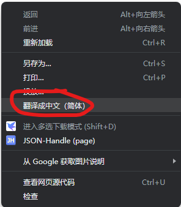
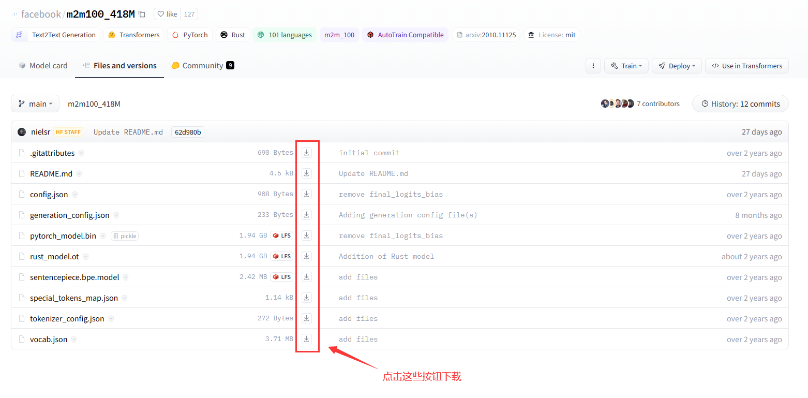
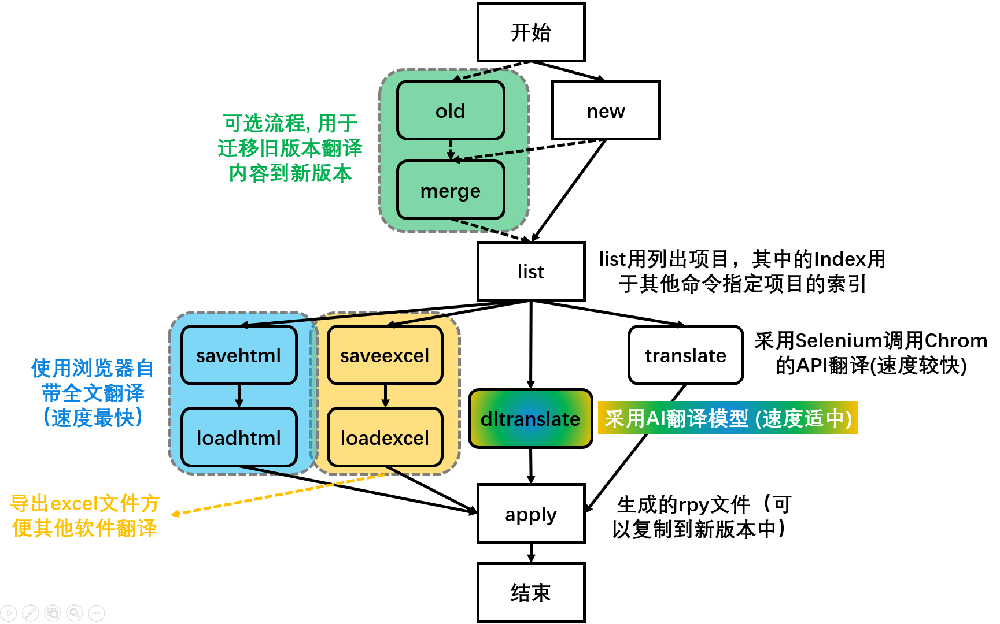
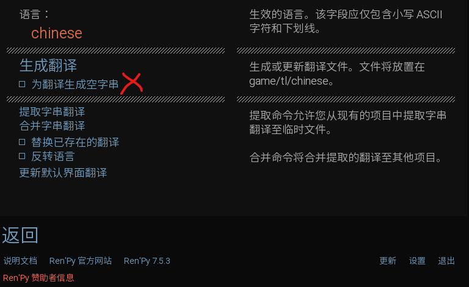
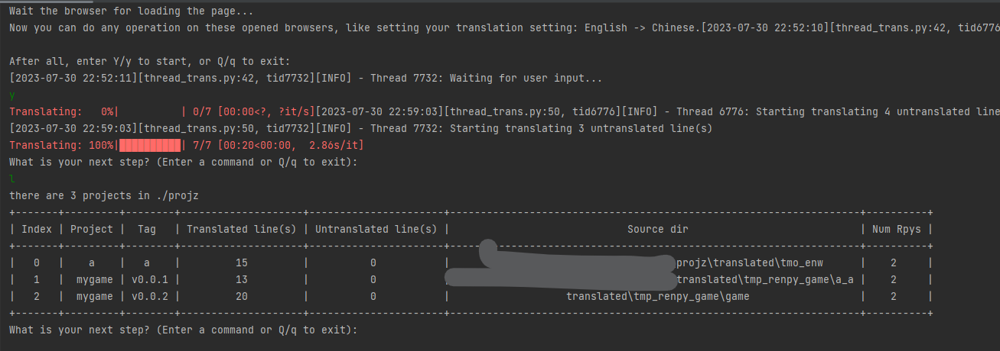

# RenPy rpy翻译文件机翻工具

- 用于迁移旧版本的rpy翻译文件和自动翻译rpy翻译文件, 机翻采用：
    1.Selenium调用Chrom的API翻译(可选)
    2.浏览器自带快速翻译(推荐)
    3.基于开源项目[dl-translate](https://github.com/xhluca/dl-translate)的AI离线翻译
- 可用的API翻译引擎：Google(速度较快，效果一般)，Caiyun(推荐，速度较快，效果好)，Youdao(速度较快)，Baidu(速度较快)
- 我们项目参考了这些项目，见: [Acknowledgement](#Acknowledgement(致谢))
- 该代码仅供学习使用。我们不提供任何游戏文件。
- 点击[parse_console.exe](parse_console.exe)即可运行，无需安装任何库。如果你要修改代码并运行，见：[运行环境准备](#运行环境准备)

***
# Changelog:
* V0.3.6: 修复了使用web翻译多线程的问题，部分命令功能改进
* V0.3.5: 基于开源项目[dl-translate](https://github.com/xhluca/dl-translate)，我们集成AI模型进行翻译，实现离线翻译的功能。 对应的新命令为`dltranslate`。
* V0.3.4: 我们把程序和运行环境打包成exe，现在你不需要python环境就可以运行程序。仅支持64位的Windows 10, 11系统
* V0.3.3: 修复`apply`命令替换空文本的问题；翻译文本识别改进；新命令`accept`:针对那些不需要翻译文本，现在你可以把未翻译文本合并到翻译的文本中
* V0.3.2: 修复翻译文本识别问题，现在能识别更多的翻译文本；新命令`dump`:现在你可以把一个项目所有翻译文本导出为excel
* V0.3.1: 添加excel文件的导入导出功能，功能与`savehtml`和`loadhtml`命令类似
* V0.3.0: 改进翻译索引，减少对翻译文本的丢弃
* V0.2.0: 使用`savehtml`和`loadhtml`快速翻译，见下文
## <mark>使用`savehtml`和`loadhtml`⚡快速⚡翻译（浏览器自带快速翻译）</mark>
使用`savehtml`和`loadhtml`命令，导出未翻译文本为html文件，然后借助Chrome或者Microsoft Edge浏览器翻译网页并保存覆盖原始html文件，实现翻译文本快速导入。请输入`help`命令获取详细信息。
### 使用步骤：
1. 使用`savehtml {proj_idx}`命令，导出未翻译文本为html文件，然后用~~Chrome~~(不建议)或者Microsoft Edge打开它。
2. 右键，使用翻译网页功能,或者在地址栏右边找到翻译网页按钮：




3. 滚动界面让所有文本都翻译完毕。
4. `Ctrl + S` 保存文件，并覆盖原始的html文件。
5. 使用`loadhtml {proj_idx}`命令，把翻译过的html文件导入项目。
6. 使用`apply {proj_idx}`命令生成rpy文件即可。
---
## <mark>使用`dltranslate`命令进行AI翻译</mark>
使用方法和`translate`命令类似：`dltranslate {proj_idx} {model_name}`，需要注意的是：
* {model_name} 可选的模型有：m2m100, mbart50, and nllb200
* 可利用NVIDIA显卡进行加速，你需要安装显卡支持CUDA和对应的pytorch（[https://pytorch.org](https://pytorch.org)）包，如何安装请网上搜索：安装显卡支持CUDA和对应的pytorch。
* 如果没有NVIDIA显卡或者不想使用显卡加速，exe已经集成相应pytoch环境直接运行即可,使用CPU进行翻译，速度较慢且对内存要求高。
* 如果在运行过程下载模型遇到问题：

    

    请手动下载模型到本地目录，假设你的保存模型目录为：`C:\hf_models`，可用模型下载地址如下：

    m2m100：https://huggingface.co/facebook/m2m100_418M/tree/main
    
    mbart50：https://huggingface.co/facebook/mbart-large-50-many-to-many-mmt/tree/main
    
    nllb200：https://huggingface.co/facebook/nllb-200-distilled-600M/tree/main
    
    选择一个模型，在模型`C:\hf_models`目录下建立一个模型同名文件夹，如`m2m100`，`mbart50`，`nllb200`，然后把所有文件下载到对应模型文件夹下，例如：`C:\hf_models\m2m100`：

    
    
    等文件都下载完后在配置文件`config.ini`中设置`MODEL_SAVE_PATH`选项：
    ```ini
    # path for saving deep models
    MODEL_SAVE_PATH=C:\hf_models
    ```
    最后重新执行exe即可。

### 使用步骤：
1. 输入`dltranslate {proj_idx} {model_name}`命令，可以参考`translate`命令，只是`model_name`可选的有：`m2m100`，`mbart50`，`nllb200`
2. 设置翻译目标，例如你想从英语翻译到中文，分别输入英语和中文对应索引号就行：
    
3. 设置模型前向每次翻译文本数量，如果你不使用显卡加速，设置4左右，看个人电脑内存情况，如果用显卡加速可以设置大一点：
    
4. 等待翻译完后使用`apply {proj_idx}`命令生成rpy文件即可。
---

## <mark>新的版本!!!</mark>

使用控制台方式来交互，不需要额外的文件拷贝，多线程支持（加快翻译速度）。 直接打开（推荐）：[parse_console.exe](parse_console.exe)

或者安装好环境后，运行python脚本：
```shell
python3 parse_console.py
```

运行效果：


## 运行环境准备
我们已经打包好所有环境（已安装必要的包）成exe文件，点击目录下的[parse_console.exe](parse_console.exe)即可运行。
如果你想要调用API翻译功能，请根据下面的步骤2的装chrome和对应的chrome driver。
如果你想要加速AI离线翻译，请根据下面的步骤3的装支持的CUDA和对应的pytorch。

**_如果你想要修改代码并运行，或者使用完整的功能，请按以下步骤进行：_**
1. 安装python3, 在本目录打开控制台输入：`pip install -r requirements.txt`
2. (可选，如果你要使用Selenium调用Chrom的API翻译)安装chrome, 下载对应的chrome driver(注意Chrome版本，如果不对请前往 [此链接，版本116以下](https://registry.npmmirror.com/binary.html?path=chromedriver/) 或者 [此链接，版本116或更高](https://googlechromelabs.github.io/chrome-for-testing/#stable)下载对应的chromedriver.exe)
3. (可选，如果你要使用NVIDIA显卡**加速**AI离线翻译)安装根据你的NVIDIA安装支持CUDA和对应的pytorch：[https://pytorch.org](https://pytorch.org)


## 注意
目录中的`parse_console.exe`不支持AI离线翻译！！！
由于每次打包支持AI离线翻译的exe文件过于庞大，请手动安装完整python环境：[运行环境准备](#运行环境准备)—步骤1，
通过脚本启动速度更快，且无需下载文件。


## 快速开始：

（可选的）首先请配置你的`chrome driver`文件路径，在`config.ini`中修改`CHROME_DRIVER`选项（如果你不想要调用API翻译功能，这步可以跳过）：

```ini
[GLOBAL]
# log path
LOG_PATH=./projz/log
# Save dir for project indexes or generate rpy files
PROJECT_PATH=./projz
# The number of thread used to translate. The larger the value, the faster the translation
NUM_WORKERS=2
# The path of chrome driver
CHROME_DRIVER=D:\Users\Surface Book2\Downloads\chromedriver_win32\chromedriver.exe
```

然后打开控制台交互程序[parse_console.exe](parse_console.exe)，或者安装好环境后运行python脚本：

```shell
python3 parse_console.py
```
### 流程速览



### 1.从旧版本renpy翻译构建(如果没有，请跳过)：

构建一个旧版本翻译项目，输入命令`old`或者`o`：

```shell
o {tl_dir} {游戏名} {版本}
```

`{tl_dir}`为游戏翻译文件所在目录，例如`D:\my_renpy\game\tl\chinese`。`{游戏名}`和`{版本}`请自定义，注意保存项目文件时候会用到它们（保存的项目文件为：`{游戏名}_{版本}.pt`），确保它们符合系统文件名要求。

一个例子：


然后试试`list`或`l`命令，他将列出当前翻译项目：

```shell
l
```

效果图：


### 2.创建新版本的翻译项目

构建一个新版本翻译项目，输入命令`new`或者`n`：

```shell
n {tl_dir} {游戏名} {版本}
```

它参数说明和`old`命令类似。

一个例子：


**注意：**

注意，我们使用renpy SDK生成翻译文件时候需要保留原始文本，不要勾选未翻译生成空字符串的选项：



之后生成的rpy文件应该是这样的：

> ```
> # game/ImaniEvents.rpy:11
> translate chinese callimanimorning_88744462:
> 
>     # "She doesn’t pick up."
>     "She doesn’t pick up."
> ```

只有这样格式的rpy，才能代码才可以识别原始文本然后进行替换。

### 3.从旧版本翻译项目合并到新版本中（如果你在第1步跳过，这里也请跳过）

首先查看我们已有项目，使用`l`命令：


之后我们使用`merge`或者`m`命令来将旧版本`mygame v0.0.1`已有翻译文本被合并到新版`mygame v0.0.2`中，这会使得新版中存在的旧版本文本得到翻译，充分利用了旧版本的翻译文本。我们只需指定它们的索引进行操作：

```shell
 m {旧翻译项目索引} {新翻译项目索引}
```

一个例子：


这了需要输入`Y`或`y`来确认指令执行。输入完后，我们可以看到我们利用旧版本`mygame v0.0.1`中13条翻译过的文本到新版本`mygame v0.0.2`中，现在我们只需要翻译剩下的7条即可！！！

再次输入`l`命令看看：


我们看到新版本`mygame v0.0.2`中已经翻译文本和为翻译的文本数量发生改变，这说明`merge`起作用了。

### 4.使用翻译引擎翻译剩余的文本：

使用`translate`或者`t`命令，只需要指定要翻译项目索引和翻译引擎即可：

```shell
 t {project_idx} {translation_API} {num_workers=1}
```

可用的`{translation_API}`有caiyu, google, baidu, and youdao。我们移除旧版本的`deepl`，因为它的问题很多。
`{num_workers}` 是可选的，表示要启动的浏览器数量，数量越多翻译速度越快，但是资源消耗量大。

一个例子：


这里程序等待你的确认以开始执行。我们可以看到启动两个窗口，这里你可以配置你的翻译目标，如设置从英语到中文的翻译：


记得，每个窗口保证相同的翻译目标设置。然后在输入`Y`或`y`在进行下一步操作，程序开始自动翻译：



我们使用`l`可以看到`mygame v0.0.2`已经翻译完了。

### 5.生成&替换

使用`apply`或`a`命令生成真实翻译文件，这也就是说：我么们之前操作并不会对原始文件进行修改，也不需要像旧版本那样拷贝rpy文件：

```shell
 a {project_idx}
```

一个例子：


你可以在`./projz\mygame_v0.0.2`目录下找到它们，而且它具有和原始路径一样的目录结构：


这意味你可以将这个文件夹剪切到新版本游戏中的原始目录进行替换，当然请记得做好备份工作。

**注意：**

使用翻译引擎的翻译文本会带有`@@`，这用于后期润色工作。如果你不需要它们，请使用VS Code全文替换功能删除它们。

## Todo List:
1. [x] ~~添加excel导入导出功能~~ (Done at 20230819)
2. [ ] 添加英语文档
3. [ ] ~~添加AI模型翻译~~ (Done at 20230908)

## Acknowledgement(致谢)
我们参考或调用代码：
* 早期项目代码（web网页翻译）参考：[Maooookai(Mirage)](https://github.com/Maooookai/WebTranslator), [DrDRR](https://github.com/DrDRR/RenPy-WebTranslator/commits?author=DrDRR "View all commits by DrDRR")
* 使用的AI离线翻译库：[dl-translate](https://github.com/xhluca/dl-translate)
* 其他使用的python库见：[requirements.txt](./requirements.txt)